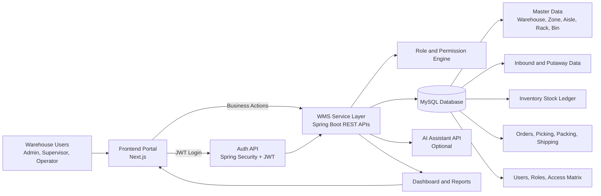
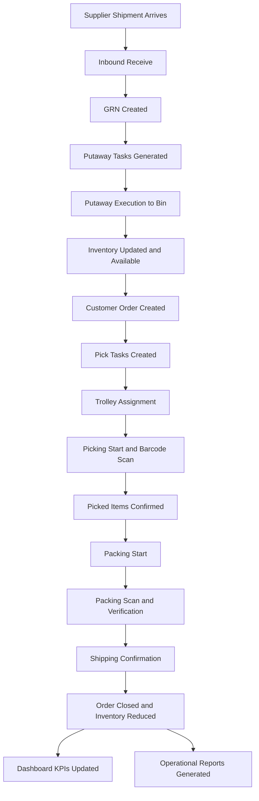
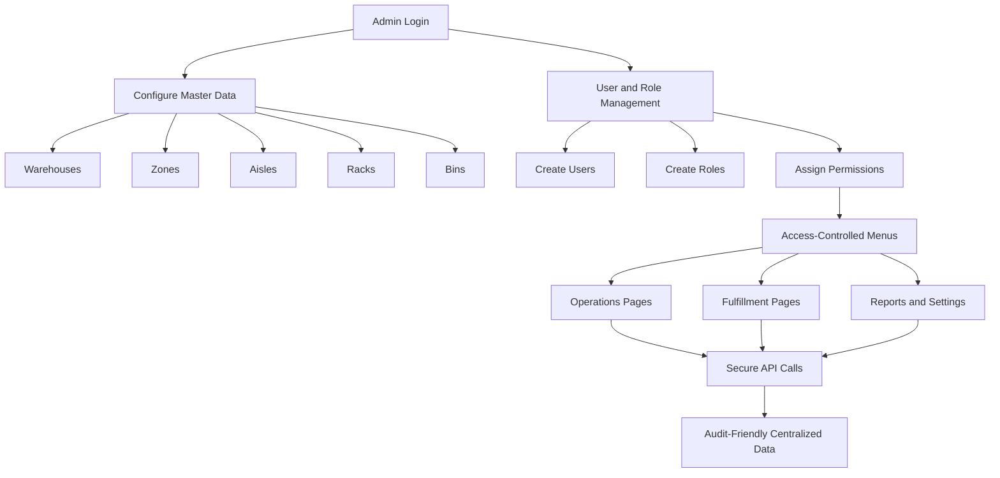

# Warehouse Management System (WMS Pro)
## Client Flow Diagram Document

Prepared on: 03 April 2026

---

## 1) Full Solution Architecture Flow

---

## 2) End-to-End Warehouse Operations Flow

---

## 3) Admin and Control Flow

---

## 4) Short Client Explanation (For Word Document)

WMS Pro follows a secure, role-based flow from inbound receiving to outbound shipping.

1. Goods are received through inbound, GRN is created, and putaway tasks store products in bins.
2. Inventory becomes available for order processing and live stock visibility.
3. Orders move through picking, trolley assignment, packing, and shipping confirmation.
4. Every operational transaction updates dashboard KPIs and reporting.
5. Admin functions control master data, user roles, and permission-based access.

This design gives traceability, stock accuracy, controlled user access, and faster order fulfillment.

---

## 5) Recommended Export Method for Client Submission

1. Open this file in VS Code preview or any Markdown viewer.
2. Copy each rendered diagram (or copy Mermaid code into mermaid.live and export PNG/SVG).
3. Paste the exported diagram images into your Word document.
4. Add the short explanation section below each diagram.

Suggested Word headings:
- Solution Architecture
- Warehouse Operations Flow
- Admin and Access Control Flow
- Business Benefits
